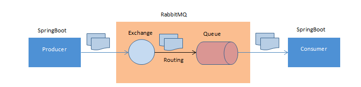
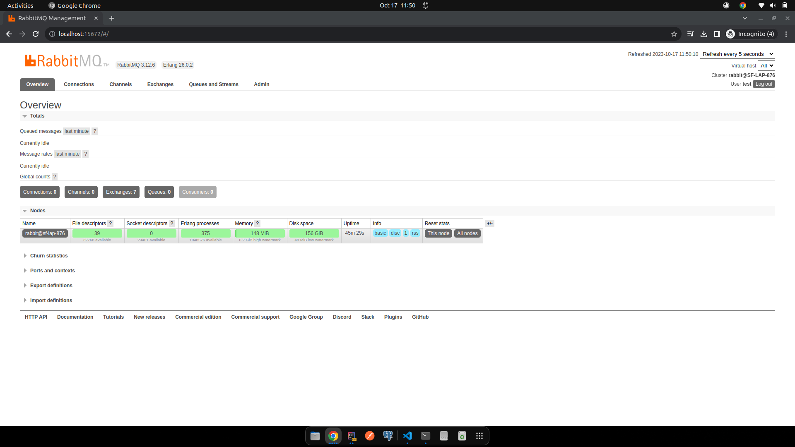

# rabbitmq-demo


this is a sample application to demonstrate how to integrate RabbitMQ with Spring Boot

## Tools

- Java 17
- Spring Boot 3.1.4
- RabbitMQ 3.12.6
- Erlang 26.0.2

## RabbitMQ

RabbitMQ is an open-source message broker software that implements the Advanced Message Queuing Protocol (AMQP). It
provides a robust, scalable, and highly available messaging system for applications. RabbitMQ allows different parts of
a system to communicate with each other, helping them be loosely coupled, scalable, and fault-tolerant.

<details>
  <summary>RabbitMQ Architecture:</summary>


</details>

<details>
  <summary>Click here to understand the key concepts associated with RabbitMQ:</summary>

### 1. **Message Broker:**

RabbitMQ acts as a message broker, facilitating communication between different components of a system. It receives,
stores, and forwards messages from producers (senders) to consumers (receivers).

### 2. **Message Queue:**

Messages sent by producers are stored in queues before being delivered to consumers. Queues act as temporary storage,
ensuring that messages are not lost even if consumers are not available to process them immediately.

### 3. **Publish-Subscribe Model:**

RabbitMQ supports the publish-subscribe messaging pattern. Producers (publishers) send messages to exchanges, which then
route the messages to the appropriate queues based on defined rules (bindings). Consumers (subscribers) can then read
messages from these queues.

### 4. **Exchange:**

Exchanges receive messages from producers and route them to one or more queues based on rules defined by bindings.
RabbitMQ supports several types of exchanges, including direct, fanout, topic, and headers exchanges, allowing for
different routing behaviors.

### 5. **Routing Key:**

In RabbitMQ, messages are sent with a routing key. The exchange uses this routing key to determine which queues should
receive the message. Consumers can subscribe to specific routing keys to receive only relevant messages.

### 6. **AMQP Protocol:**

RabbitMQ implements the Advanced Message Queuing Protocol (AMQP), an open standard messaging protocol. AMQP defines the
format and structure of messages, ensuring interoperability between different messaging systems and clients.

### 7. **Durability and Reliability:**

RabbitMQ allows you to configure queues and messages as durable, ensuring that they survive server restarts. This
feature is essential for applications where message persistence and reliability are crucial.

### 8. **Clustering and High Availability:**

RabbitMQ supports clustering, allowing multiple RabbitMQ nodes to work together as a single logical broker. Clustering
provides scalability and fault tolerance. Additionally, RabbitMQ can be configured for high availability, ensuring that
messages are not lost even if some nodes fail.

### 9. **Management and Monitoring:**

RabbitMQ provides a web-based management interface, allowing administrators to monitor queues, exchanges, connections,
and other aspects of the RabbitMQ server. It offers features like user management, virtual host configuration, and
policy settings.
</details>


<details>
<summary>To install RabbitMQ on Ubuntu, you can follow these steps:</summary>

### Step 1: Update the Package Repository

Open a terminal window and run the following command to update the package repository information:

```bash
sudo apt update
```

### Step 2: Install RabbitMQ Server

Run the following command to install RabbitMQ:

```bash
sudo apt install rabbitmq-server
```

During the installation, the RabbitMQ service will start automatically. If it doesn't, you can start it manually using
the following command:

```bash
sudo systemctl start rabbitmq-server
```

### Step 3: Enable and Start RabbitMQ Service

RabbitMQ is installed but not enabled by default. You can enable and start the RabbitMQ service using the following
commands:

```bash
sudo systemctl enable rabbitmq-server
sudo systemctl start rabbitmq-server
```

### Step 4: Set Up RabbitMQ Management Plugin (Optional)

To access the RabbitMQ management web interface, you need to enable the RabbitMQ Management Plugin. Run the following
command to enable the plugin:

```bash
sudo rabbitmq-plugins enable rabbitmq_management
```

By default, the management interface can be accessed at `http://localhost:15672/`. The default username is `guest` and
the default password is also `guest`.

### Step 5: Access RabbitMQ Management Interface (Optional)

You can access the RabbitMQ management interface in your web browser by visiting `http://your-server-ip:15672/`. Use the
default credentials (`guest`/`guest`) to log in.

</details>

<details>
<summary>If you face any problem in accessing management interface with guest account, you can follow this steps to create a new user with admin permissions:</summary>

To create a new user named `test` with the password `test` and grant admin privileges, follow these steps:

### Step 1: Create a New User

Open a terminal window and enter the following command to create a new user named `test`:

```bash
sudo rabbitmqctl add_user test test
```

### Step 2: Set User Permissions

Set the user permissions. For an admin user, you can give permissions to everything (`.*`) on all virtual hosts (`/`).
Enter the following command:

```bash
sudo rabbitmqctl set_permissions -p / test ".*" ".*" ".*"
```

This command grants the `test` user full permissions (configure, write, read) on all resources within the virtual
host `/`.

### Step 3: Set User Tags (Optional)

You can also set the `administrator` tag to grant admin privileges explicitly. While the permissions set in Step 2 are
sufficient, setting the `administrator` tag will allow the user to manage RabbitMQ via the management interface.

```bash
sudo rabbitmqctl set_user_tags test administrator
```

Now, the `test` user has admin access to RabbitMQ. After successful login you will be able to see the following
dashboard.


</details>
